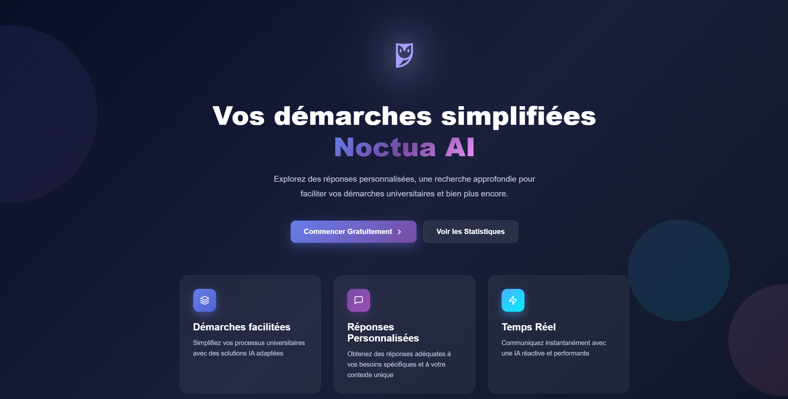
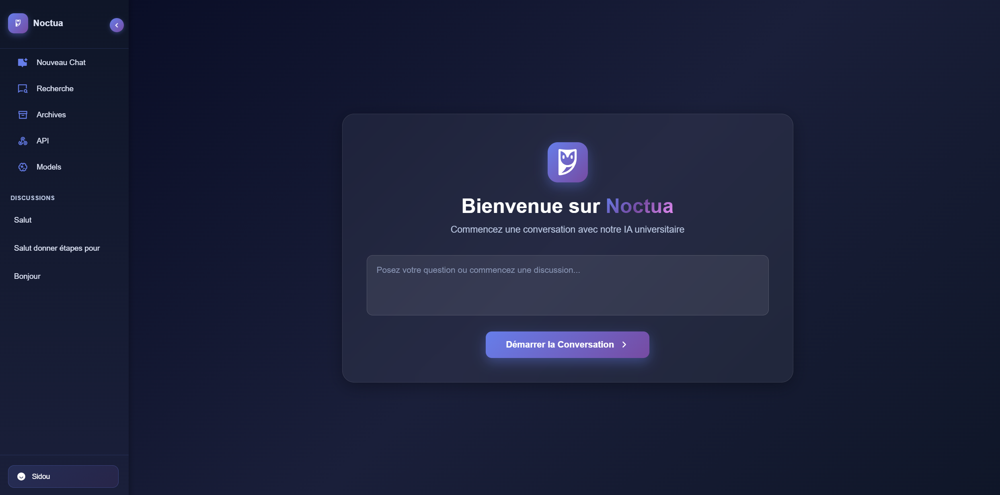
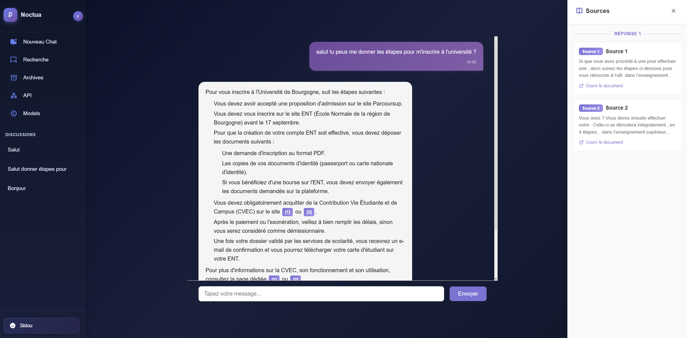

# Noctua AI

> AI-powered university assistant — Université de Bourgogne.

## Description

**Noctua AI** is a conversational web application designed to help students at the Université de Bourgogne navigate university processes. The assistant answers questions about student life and administrative procedures using a **RAG** (Retrieval-Augmented Generation) pipeline to provide source-backed, reliable answers.

A **REST API** is also exposed for third-party integrations.

## Features

- Real-time conversational chatbot (Socket.io)
- Source-backed answers via RAG + Mistral LLM
- REST API for external integrations
- Docker support for easy deployment

## Tech stack

| Technology | Usage |
|---|---|
| Node.js | Backend |
| Socket.io | Real-time communication |
| Mistral LLM | Language model |
| RAG Pipeline | Grounding responses in source documents |
| EJS | Front-end templating |
| Docker | Containerization |

```
JavaScript  54.2%
CSS         27.5%
EJS         16.8%
```

## Screenshots

| | |
|---|---|
|  |  |
|  | |

## Requirements

- Node.js 18+
- Mistral API key

## Getting started

```bash
npm install
cp .env.example .env   # Set your Mistral API key
npm start
```

## Author

**Sid Ali** — Université de Bourgogne, M2
